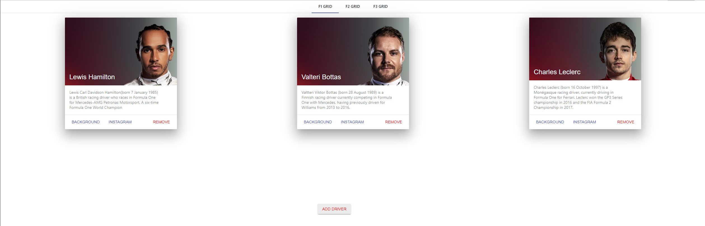
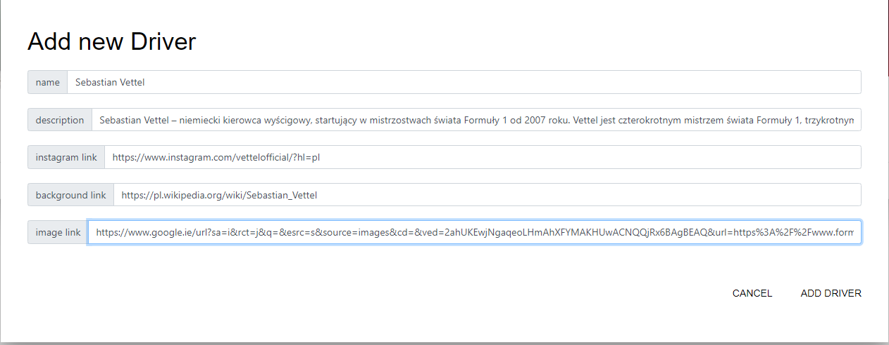
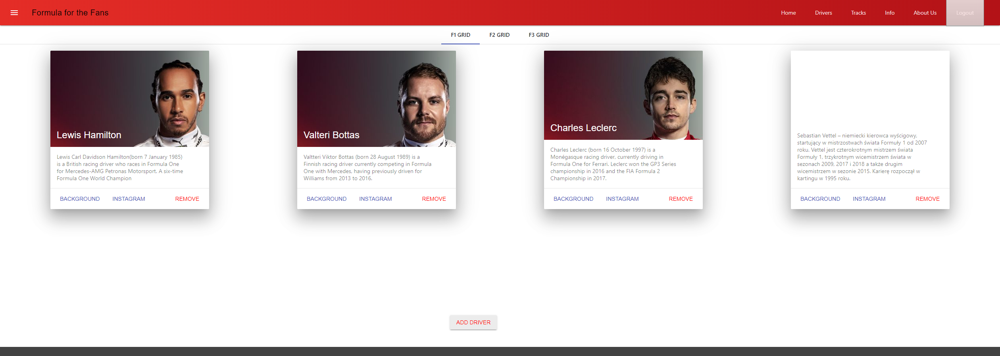
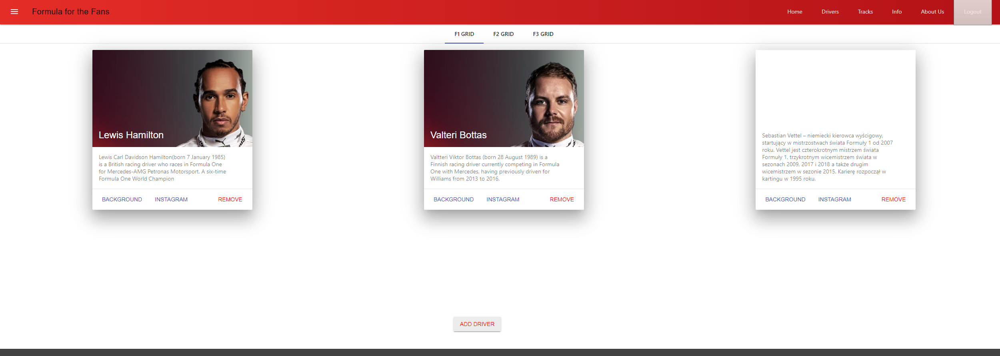
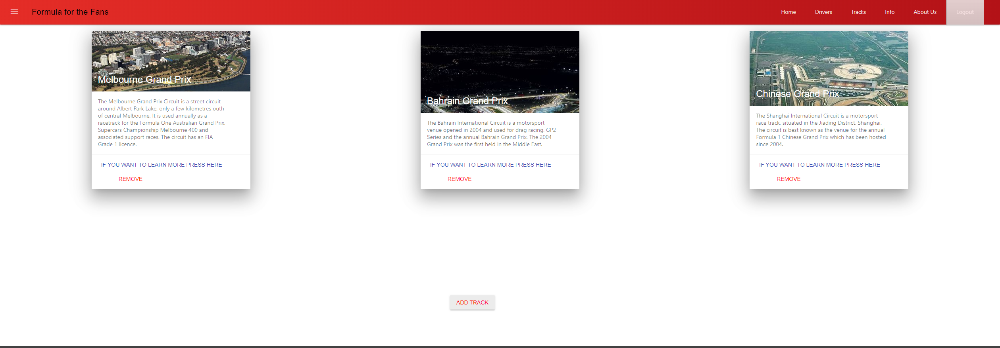
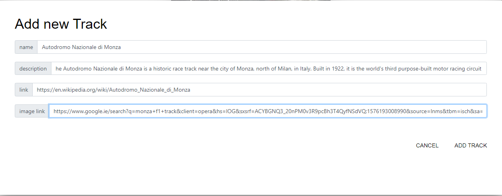
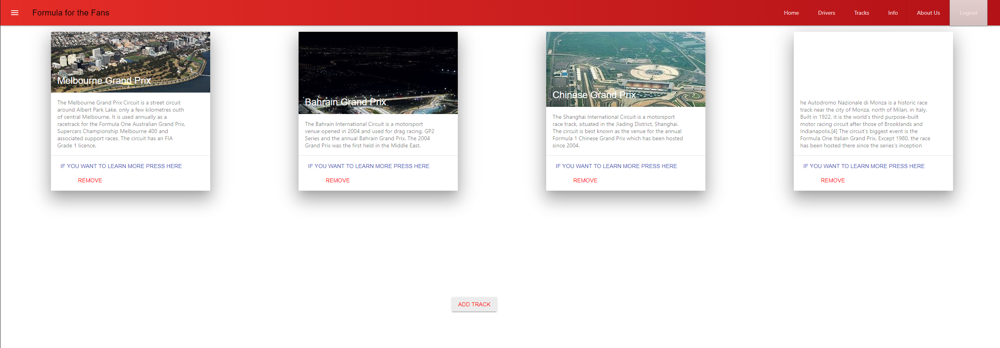
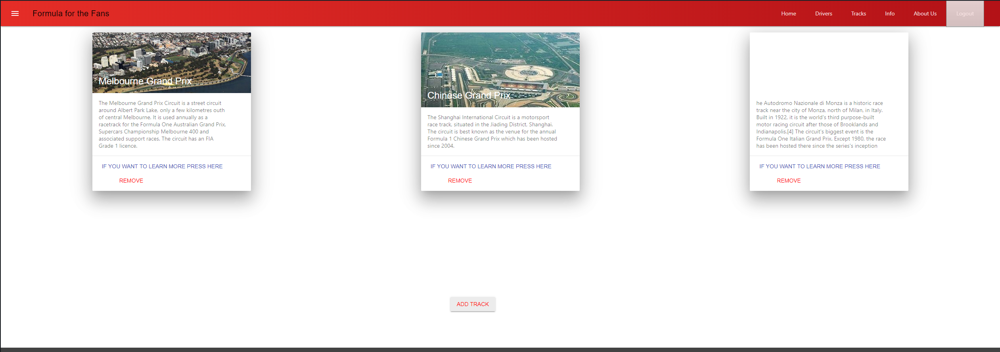

# BSc (Hons.) Level 8 - Assignment 2 - Single Page app.

Name: Kasper Gutkowski

##  Overview

The second assignment was to create an API to the web app that we previously created using react.

....List of features .....

- Add new Driver to the API
- Delete the driver from the API.
- Firebase implemented
- Mongoose and MongoDB localhost

##  Setup

When adding the API to the formula 1 app I followed the labs of installing all necessary files to implement the API. Then using mongo I created a database and created an .env file that stored the localhost address there so it would be possible to connect to the server.

## Design after API implementation

Driver tab after implementing API. Now you can add drivers using the add driver button.

Entering necessary details into the boxes and pressing Add driver will add a new driver to the tab and to the API.

Displaying the new driver that was added.

When the remove button is clicked the driver is deleted by id from the tab display and from the API.

Tracks tab after API implementation.

Adding the track to the API.

Track that was added to the API is now displayed.

Track was removed using the remove button from the display and from the API.

## Independent Learning
Most of this assignment was independent learning as the labs were not clear enough on how to connect a web app that was one from the in class labs. Most of the assignment had to be reasearched on Youtube, stackoverflow and many other websites in order to figure out details on how to connect the API to the web app.
